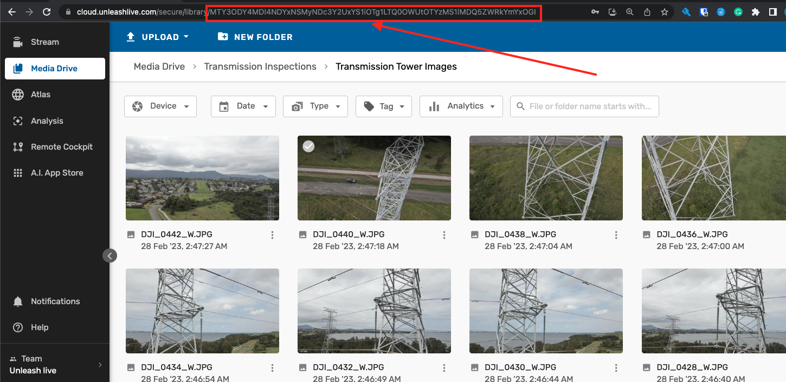

## Media Drive
All files can be found in `media-drive/examples` folder.
If you are using Webstorm then "run configuration" are available by default and are stored in `.idea/runConfigurations`.
Media Drive samples aim to give third-party developers a clue about possible ways of implementing their API client.

### Introduction
A sample Node.js API for basic functionality in Media Drive. The basic functions include signing in, listing items in the folder, uploading/downloading files, moving/deleting files, renaming their names, etc.

### Steps

#### Download and build locally
1) Clone the repository and install Node packages locally.
```bash
git clone https://github.com/unleashlive/samples.git
cd 'javascript'
npm install
```

#### Update config
2) Gather and update all the informations for setting up config environment.
   The information includes:
   
```bash
cd 'javascript/config'
```

Update the `user.js` file with your username and password 
```javascript
export let USER_NAME = "test@user-name.com";
export let PASSWORD = "test-pass";
```
- "test@user-name.com": The same login email that is used to login into [cloud.unleashlive.com](https://cloud.unleashlive.com/auth/sign-in)

- "test-pass": Password for the above login email.

Update the `media-config.js` file with `Folder_ID`.
```javascript
export let FOLDER_ID = "item1";
```
`item1` (Folder ID or id is the identification keys of the folder in Media Drive)

To get any folder id in Media Drive:

- Go to https://cloud.unleashlive.com, login to your account, open the folder that you want to query in your browser and copy the ID from the web address as seen in the image below.
  

### login.js
`login.js` allows you to verify your login credentials and also verifies your request to further use the API.
If everything is all set, you should be able to get the following response:
```bash
  statusCode: 200,
  response: {
    token: {
      accessToken: ********,
      idToken: ********,
      refreshToken: *******,
      identityId: XXXXXXX,
      companyId: XXXXXXX,
      teamId: XXXXXXX
    },
    email: 'XXXX@unleashlive.com',
    exp: XXXXXX,
    uid: 'XXXXXX',
    auth_time: XXXXXXX,
    token_use: 'id'
  }

```
### list.js
To list the items in a folder, the folder ID needs to be [updated](#Update-config).
`list.js` allows you to list all the items in that particular Folder ID.
If you want to list a certain number of items, make changes in the `limit` key inside the query list.
```bash
  const listQuery = gql`
    query list {
      list(
        sort: desc
        location: "${location}"
        limit: <User can assign this number, by default its 2>
      ) {
        items {
          teamId
          location
          type
          tags
          createdAt
          deviceId
          id
          name
          parentId
          s3Path
          updatedAt
          mimeType
          metadata {
            isPanoramic
            duration
          }
        },
        nextToken {
          pk
          sk
          locationCreatedAt
          teamId
          teamIdType
          createdAt
          searchNameCreatedAt
          searchName
          deviceId
          type
        }
      }
    }
```
### upload.js
- To run the `upload.js`,  it is necessary to set the file name and file path.
- The runtime configurations and working directory should be correctly set. The working directory is set to: `samples/javascript/media-drive/`, and `upload.js` must be selected as the JavaScript run configuration file.

### download.js
- To download the file, you must specify the folder ID from which the files need to be downloaded. The folder id needs to be [updated](#Update-config).

For further support please email us at [support@unleashlive.com](mailto:support@unleashlive.com)